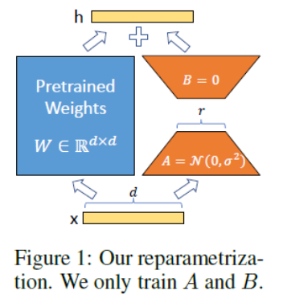

### 开篇

2023 年，聊天机器人领域似乎只剩下两个阵营：「OpenAI 的 ChatGPT」和「其他」。

ChatGPT 功能强大，但 OpenAI 几乎不可能将其开源。「其他」阵营表现欠佳，但不少人都在做开源方面的努力，比如前段时间 Meta 开源的 LLaMA。

LLaMA 是一系列模型的总称，参数量从 70 亿到 650 亿不等，其中，130 亿参数的 LLaMA 模型「在大多数基准上」可以胜过参数量达 1750 亿的 GPT-3。不过，该模型并没有经过指令微调（instruct tuning），因此生成效果较差。

为了提高模型性能，来自斯坦福的研究者帮助其完成了指令微调的工作，训练了一个名为 Alpaca（羊驼）的 70 亿参数新模型（基于 LLaMA 7B）。具体来说，他们让 OpenAI 的 text-davinci-003 模型以 self-instruct 方式生成 52K 指令遵循（instruction-following）样本，以此作为 Alpaca 的训练数据。实验结果表明，Alpaca 的很多行为都与 text-davinci-003 类似。也就是说，只有 7B 参数的轻量级模型 Alpaca 性能可媲美 GPT-3.5 这样的超大规模语言模型。

## 名词术语

### 模型

### 大模型

### Finetune

Finetune是指在一个已经预先训练好的机器学习模型的基础上，通过在特定领域或任务的数据集上重新训练模型，以进一步提高其性能。这个过程通常涉及到在已经预训练好的模型上微调参数，以适应新的数据集和任务。

例如，在自然语言处理中，可以使用一个在大规模语料库上预先训练好的语言模型，如BERT或GPT，然后在特定的文本分类任务中，使用任务特定的数据集对模型进行Finetune。在这种情况下，模型会保留在预训练期间获得的大量通用知识，同时在新任务上通过Finetune进行微调，以更好地适应新的任务和数据集。

通过Finetune，可以利用预训练模型的大量通用知识，以及更少的特定任务数据来获得更好的性能。这使得Finetune成为一种非常有效的迁移学习方法。

您可以将Finetune理解为对通用大模型的精调。通常，预先训练的模型是使用大量数据在通用任务上进行训练，例如在大规模语料库上进行自然语言处理预训练。这样的模型在处理自然语言时已经具有一定的语义理解能力，可以处理许多不同的自然语言处理任务。

但是，对于某些具体的任务，例如文本分类或命名实体识别，预先训练的模型可能需要进一步调整，以更好地适应任务特定的数据和目标。这就需要对模型进行Finetune，通过在任务特定的数据集上微调模型参数，以进一步提高模型的性能。

因此，Finetune可以被视为在预先训练的模型的基础上进行的一种精细调整，以适应任务特定的数据和目标。这种方法旨在利用预先训练的模型所学习的通用特征，同时通过微调特定任务的相关参数，以获得更好的性能。

### 模型量化

模型量化是指通过压缩和优化模型，将其从原始的高精度表示转换为低精度表示，以在保持模型精度的同时减少模型的计算和存储需求。模型量化通常涉及到将模型参数和激活值表示为比浮点数更低的精度格式，例如整数或浮点数的半精度。
  
模型量化通常需要进行以下几个步骤：

1.量化模型参数：将模型参数从浮点数转换为低精度格式，例如8位整数。可以使用不同的量化方法，例如线性量化或对称量化，以保持模型的精度并减少内存占用。

2.量化模型激活值：在模型的前向传递过程中，将输入数据和中间激活值转换为低精度格式，例如8位整数。这可以通过在前向传递中应用量化操作来实现，以减少计算和内存需求。

3.对量化后的模型进行微调：为了确保量化后的模型仍然能够保持良好的性能，需要使用一些微调技术来进一步优化量化后的模型。这包括重新训练量化后的模型，或者使用一些修剪、蒸馏等技术来改进量化后的模型。

通过模型量化，可以显著减少模型的存储需求和计算量，从而在保持模型准确性的同时提高模型的执行速度和效率。这使得模型量化成为在资源受限的环境中部署深度学习模型的一种重要技术。

### tokenizer
tokenizer在中文中叫做分词器或标记器，是用来对文本进行预处理的一个工具，

首先，标记器会把输入的文档进行分割，将一个句子分成单个的word（或者词语的一部分，或者是标点符号）这些进行分割以后的到的单个的word被称为tokens。

第二步，标记器会把这些得到的单个的词tokens转换成为数字，经过转换成数字之后，我们就可以把它们送入到模型当中。

为了实现这种能把tokens转换成数字的功能，标记器拥有一个词表，这个词汇表是在我们进行实例化并指明模型的时候下载的，这个标记器使用的词汇表与模型在预训练时使用的词汇表相同，它就是tokenizer.model，是单词与数字的映射，跟随模型保存和读取的时候一起使用

**注意：** llama系列的模型7B 13B 65B的tokenizer.model是相同的，但llama和alpaca的tokenizer不可混用，tokenizer.model文件需要在模型文件的父节点上

### LoRA

在本文中，我们将展示如何使用 大语言模型低秩适配 (Low-Rank Adaptation of Large Language Models，LoRA) 技术在单 GPU 上微调 110 亿参数的 FLAN-T5 XXL 模型。在此过程中，我们会使用到 Hugging Face 的 Transformers、Accelerate 和 PEFT 库。

[五段代码复现Alpaca-LoRA：A minimal Implementation of Alpaca-LoRA](https://zhuanlan.zhihu.com/p/615131132)

[深入理解LLaMA, Alpaca, ColossalChat 系列模型
](https://blog.csdn.net/qq_27590277/article/details/129965077)

[参考链接](https://finance.sina.com.cn/tech/roll/2023-03-26/doc-imynemwf9000026.shtml)