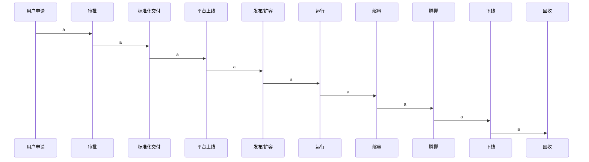
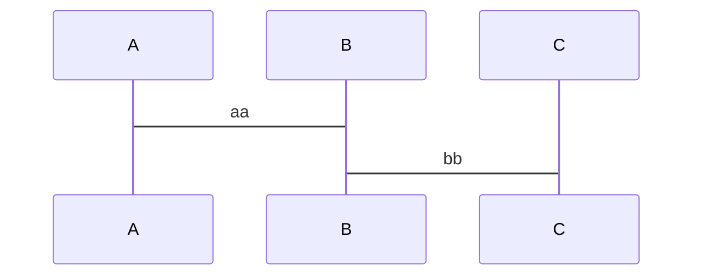
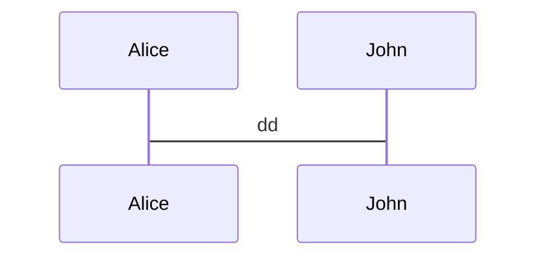

## 资源流转效率
资源的流转过程不能用于实际生产，流程效率低下会造成成本的浪费。

- 申领
- 回收

## 资源使用率

## 成本透明

- 用量
- 单价
- 总量
- 结算规则
- 资源使用率

如果所有成本只是一个总账单，没有每个资源项的使用明细，使用方就不知道哪些资源使用不合理，很难进行针对性优化

## 资源归属

让成本有明确的负责人，只有有明确的负责人，不能有模糊地带

## 单位成本

## 资源规划

- 预算
- Quota
- 二级资源池

